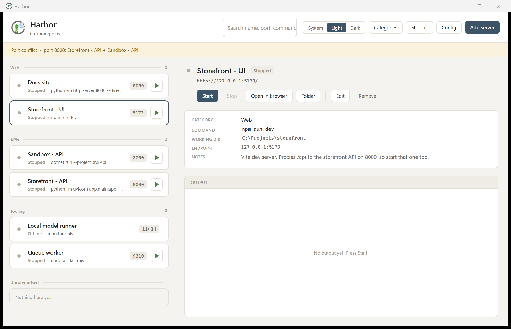
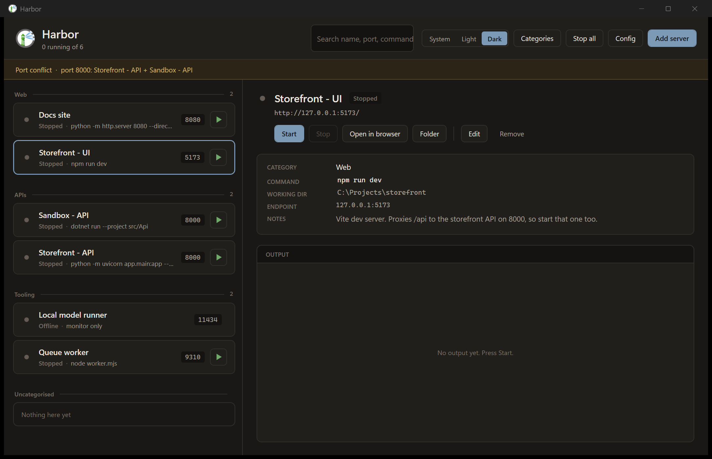

# Harbor

A small Windows desktop app for the local dev servers scattered across your projects. Store the
command, the folder and the port once; see at a glance what is up; start and stop without hunting
for a terminal.



<sub>Dark theme:</sub>



## Why

If you work across several projects, you accumulate dev servers — a Vite UI here, a FastAPI
backend there, a Python static server, something in an editor that binds a port. Each one has a
command you half-remember, a folder it must run from, and a port that collides with something
else. Harbor is a place to write that down once and then just press play.

## What it does

- **Stores a config per server** — name, category, the exact command line, working directory,
  host, port, URL path, environment variables and free-text notes.
- **Runs anything a shell can run.** Commands go through `cmd.exe /d /s /c`, so `npm run dev`,
  `python scripts/dev_server.py`, `python -m uvicorn app.main:app`, `dotnet run`, `.bat` files
  and PATH lookups all behave exactly as they do in a terminal.
- **Shows live status** by reading the TCP listener table every two seconds. Four states:
  *Running* (Harbor owns the process and the port is bound), *Starting* (process up, port not
  bound yet), *External* (something is on the port that Harbor did not launch), *Stopped*.
- **Stops the whole process tree.** `npm run dev` becomes cmd → npm.cmd → node → node; killing
  only the spawned process leaves `node.exe` holding the port. Harbor puts the process in a
  Windows **job object** with `KILL_ON_JOB_CLOSE`, so the tree dies together — and still dies if
  Harbor itself is killed.
- **Flags port conflicts** across every stored entry, in a banner at the top.
- **Streams stdout and stderr** into a per-server output pane, stderr in red.
- **Monitor-only entries** for servers something else launches — an in-editor MCP server, a
  container, a service on another host. Harbor watches the port but never tries to start it.
- **Configurable categories** — add, rename, delete and reorder. An empty category still shows,
  and deleting one moves its servers to *Uncategorised* rather than losing them.
- **Light and dark**, with *System* following the Windows setting and reacting live. Switching
  repaints immediately, native title bar included, with no restart.

## Requirements

Windows 10/11 and the [.NET 10 Desktop Runtime](https://dotnet.microsoft.com/download/dotnet/10.0).

## Build

```bash
dotnet build src/Harbor/Harbor.csproj
```

Single-file publish:

```bash
dotnet publish src/Harbor/Harbor.csproj -c Release -r win-x64 --self-contained false -p:PublishSingleFile=true
```

Add `--self-contained true` for a build that does not need the runtime installed (larger).

## Install

**Installer (recommended):** download `HarborSetup.exe` from the
[latest release](https://github.com/jbowensii/Harbor/releases) and run it. It installs the
executable to `%LOCALAPPDATA%\harbor`, puts a Harbor shortcut on the desktop, and seeds an empty
configuration in `%APPDATA%\Harbor` on first install (an existing configuration is never
touched). Per-user install — no admin rights needed. Uninstall from *Settings → Apps* as usual;
your configuration is kept.

**Manual install** works exactly as before — Harbor is a single executable and copying it into
place is the whole procedure.

1. **Get the exe** — download `Harbor.exe` from the
   [latest release](https://github.com/jbowensii/Harbor/releases), or build it yourself with the
   publish command above.
2. **Choose a folder.** `%APPDATA%\Harbor\` works well: paste
   `%APPDATA%\Harbor` into the Explorer address bar, create the folder, and drop `Harbor.exe` in.
   Any folder you can write to is fine — Harbor keeps its configuration in `%APPDATA%\Harbor\`
   regardless of where the exe lives.
3. **Copy `harbor.ico`** (from `src/Harbor/` in this repo) next to the exe.
4. **Make a shortcut.** Right-drag `Harbor.exe` to the Desktop → *Create shortcuts here*. Then
   right-click the shortcut → *Properties* → *Change Icon* → browse to `harbor.ico`.

   Point the icon at **`harbor.ico`, not at the exe**. The Windows shell extracts icons from
   single-file .NET executables unreliably, and a shortcut that takes its icon from the exe tends
   to lose it whenever the exe is replaced.
5. **Run it.** The first launch starts with an empty list. Press **Add server** to create your
   first entry.

To uninstall, delete the exe and the `%APPDATA%\Harbor` folder. Nothing is written to the
registry, and no services or startup entries are created.

## Files

Harbor keeps everything in `%APPDATA%\Harbor\`. The **Config** button in the header opens that
folder.

| File | Purpose |
|---|---|
| `servers.json` | Your configuration: theme, ordered categories, servers |
| `servers.json.bak` | Previous generation, rewritten on each save |
| `harbor.log` | Activity log, rolls to `harbor.log.1` at 1 MB |
| `servers.seed.json` | *Optional.* If present next to the exe, it is imported when `servers.json` is missing |

**No configuration ships with this repository.** `servers.json` describes one particular machine —
local paths, ports, sometimes internal hostnames — so it is yours to create and is git-ignored
here.

`servers.seed.json` is a convenience you can opt into: copy your own `servers.json` next to the
exe under that name and it becomes a restore point, re-imported if the live config is ever lost.

Saves go to a temp file and are then swapped in, so an interrupted save cannot truncate the real
one. A config that fails to parse is copied to `servers.json.broken-<timestamp>` rather than
being overwritten.

## Logging

Each run logs a header (version, exe path, resolved `%APPDATA%`, log path), then:

- **Config load** — the resolved path, whether the file existed, a listing of the config folder
  as that process could see it, and how many servers and categories came back
- **Config save** — how many entries were written, and where
- **Server lifecycle** — start with pid, port and command line; a warning when a server exits on
  its own with a non-zero code; confirmation when a process tree is stopped
- **Errors** — the full exception, stack trace included

The folder listing is there for a specific failure mode: "the app opened empty" is otherwise
indistinguishable from "nothing is configured". Some sandboxed hosts redirect `%APPDATA%` to a
private per-app copy, so a helper script and the app can read *different files* while both look
correct in isolation. The listing makes that visible immediately.

## Layout

```
src/Harbor/
  Models/       ServerEntry, ServerStatus, HarborConfig
  Services/     ProcessRunner (launch + job object), JobObject (P/Invoke),
                PortMonitor (TCP table + remote probe), ConfigStore (JSON),
                ThemeService (dictionary swap), Log
  ViewModels/   MainViewModel, ServerItemViewModel, CategoryViewModel
  Views/        MainWindow, EditServerWindow, CategoryManagerWindow, TextPromptWindow
  Themes/       Light.xaml and Dark.xaml - the whole design system, twice
build/          make-icon.ps1 (multi-size .ico), preview-icon.ps1 (contact sheet)
```

### Notes for anyone editing the XAML

Both theme files define an identical set of resource keys, and the views bind them with
`DynamicResource`. That is what makes switching instant — a `StaticResource` resolves once at load
and would keep pointing at the old brush. Two consequences:

- `Style.BasedOn` and `Binding.Converter` **cannot** take a `DynamicResource`. Styles that need
  `BasedOn` therefore live in the theme files (see `CardStartButton`), and converters stay
  `StaticResource`.
- A `Trigger` on `Tag` compares against a string, because `Tag` is typed `object`. Binding a
  `bool` there and testing `Value="True"` silently never matches.

## Credits

The lighthouse artwork is the [Harbor](https://goharbor.io/) project logo, via
[dashboardicons](https://dashboardicons.com/). It is used here only as a local application icon;
this project is unaffiliated with, and not endorsed by, the Harbor container registry or the CNCF.
Swap `build/harbor-source.png` and re-run `build/make-icon.ps1` to use your own.

## License

[MIT](LICENSE)
